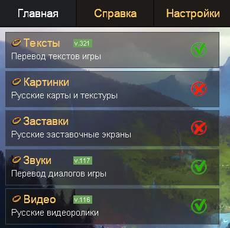
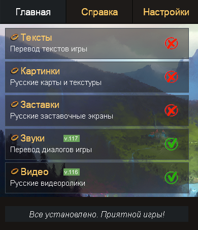
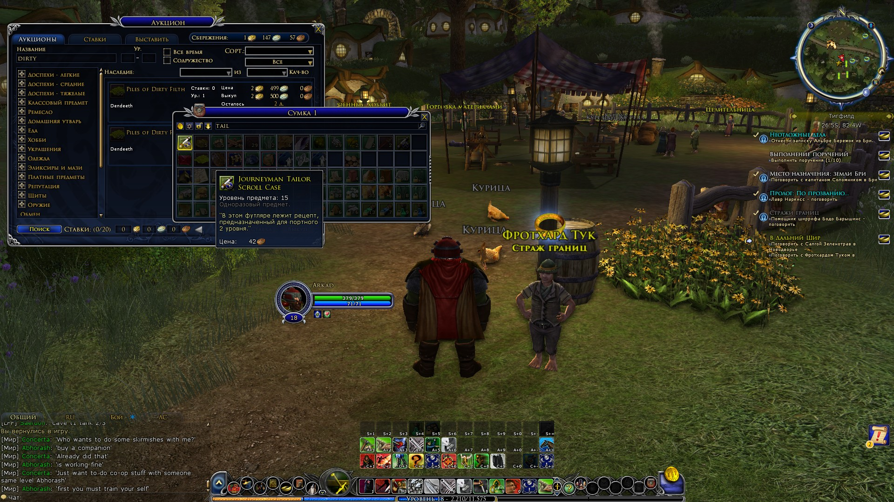

# Westronize

Модульный патчер локализации для LOTRO, создающий "гибридную" локализацию из Наследия:
*   **Английские названия** (Предметов, Умений, Талантов и Добродетелей)
*   **Русские описания**
*   **Русский интерфейс**

## Принцип работы

Этот инструмент — костыль, эксплуатирующий механизм отката изменений в [Наследии 3.0](http://translate.lotros.ru/pages/legacy-v3.html). 

Берем оригинальную английскую базу (бекап созданный Наследием), накатываем на неё *полный* русский перевод, а затем точечно "откатываем" назад названия предметов, умений и талантов, оставляя при этом русские описания и интерфейс. Полученную базу подсовываем "Наследию" под видом оригинального бекапа, и когда просим "Наследие" удалить русификацию текста, оно, думая, что восстанавливает оригинал, на самом деле устанавливает нашу гибридную версию.

## Установка

Установить можно напрямую из репозитория:

```bash
pip install git+https://github.com/gemoroy/westronize
```

## Quickstart

### С самого начала (если Наследие еще не установлено)

1.  Сделайте резервную копию файла `client_local_English.dat` в папке игры (обычно `Program Files (x86)/StandingStoneGames/The Lord of the Rings Online/`).
2.  Установите и запустите [Наследие 3.0](http://translate.lotros.ru/pages/legacy-v3.html).
3.  Примените русификатор (у меня это Тексты, Звуки и Видео).



### Скорее всего вы начнете отсюда (если Наследие уже стоит)

1.  Перейдите в директорию данных Наследия: `Program Files (x86)/Legacy_3.0/data`.
2.  Откройте терминал в этой папке и выполните команду:
    ```bash
    westronize --ru-db texts_U46.1.0_v3.2.1.db
    ```
    *(Примечание: версия `texts_U46.1.0_v3.2.1.db` актуальна на момент написания, проверяйте имя файла у себя в папке)*
3.  Сделайте бекап или удалите файл `Texts_en_orig.db`.
4.  Переименуйте созданный файл `westronized.db` в `Texts_en_orig.db`.
5.  Откройте [Наследие 3.0](http://translate.lotros.ru/pages/legacy-v3.html), **снимите** галочку с пункта "Тексты" и нажмите "Внести выбранные изменения".
6.  Дождитесь завершения процесса ("отмены" патча).



7.  Enjoy!


## Настройка

По умолчанию инструмент обрабатывает: **items** (предметы), **skills** (умения), **traits** (таланты\добродетели).

Вы можете выбрать конкретные модули с помощью флага `--blocks`:

```bash
westronize --ru-db texts_U46.1.0_v3.2.1.db --blocks items,skills
```

## Планы

*   **Настройки (Options/UI):** Хочется вернуть английские названия в меню настроек, потому что там тоже есть поле поиска, и искать настройки на русском - лучше не придумаешь.
*   **Меньше костылей:** но это к Наследию скорее.

## Благодарности

*   [Наследие](http://translate.lotros.ru/) за их титанический труд по переводу игры.
*   [LotroCompanion](https://github.com/LotroCompanion). Используется [lotro-data](https://github.com/LotroCompanion/lotro-data) как источник XML-данных для идентификации предметов и умений в базах. Шаг возможно лишний, но удобный.
